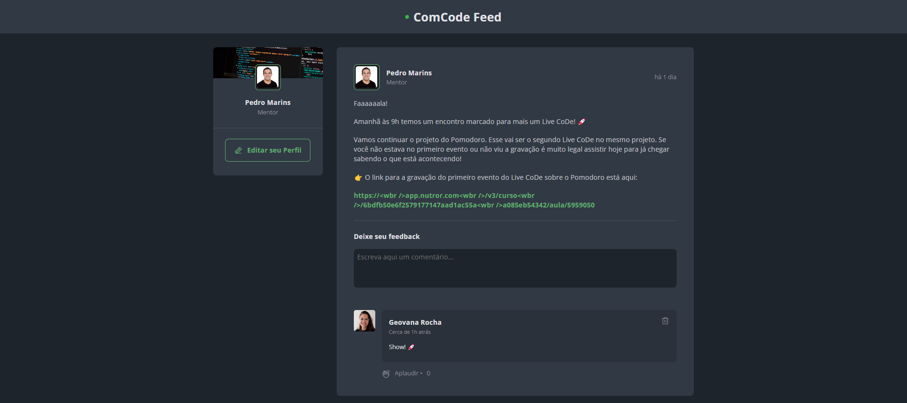

<h1 align="center"> 🟢 ComCode Feed </h1>

Feed de um app ficticio da Comunidade Code com o objetivo de aplicar conceitos dos estudos do React.

  <a href="#-tecnologias">Tecnologias</a>&nbsp;&nbsp;&nbsp;|&nbsp;&nbsp;&nbsp;
  <a href="#-projeto">Projeto</a>&nbsp;&nbsp;&nbsp;|&nbsp;&nbsp;&nbsp;
  <a href="#-layout">Layout</a>&nbsp;&nbsp;&nbsp;|&nbsp;&nbsp;&nbsp;
  <a href="#memo-licença">Licença</a>

 

  

## 🚀 Tecnologias

Esse projeto foi desenvolvido com as seguintes tecnologias:

- Vite
- ReactJS
- CSS Modules
- date-fns
- phosphor-icons
- UUID
- Hooks

 

## 💻 Projeto

O ComCode Feed simula um ambiente de comunidade / social media, onde é possível:

- criar um comentário em uma determinada publicação já existente,
- excluir um comentário,
- aplaudir um comentário quantas vezes quiser (diferente da curtida que é apenas uma por comentário)

 

## 📧 Contato

geovana.rocha.martins@gmail.com

 

---

Feito por 💻 Geovana Rocha 
